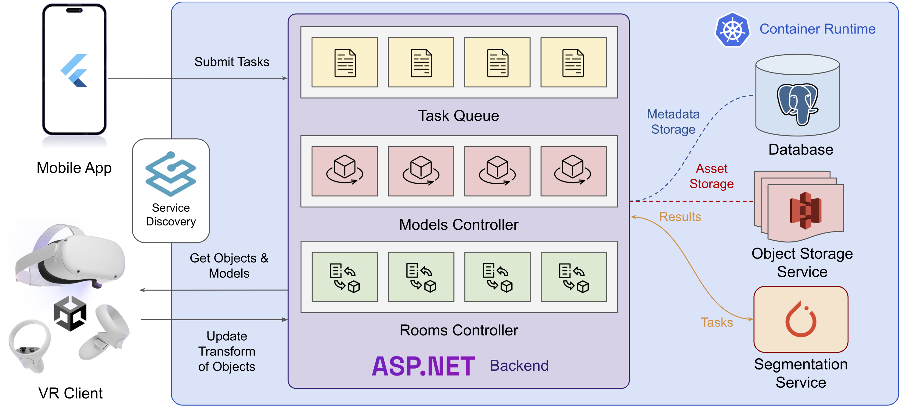

# 3D Room Arrangements using Virtual Reality

Welcome to the repository of the source code of the project "3D Room Arrangements using Virtual Reality", a VR-based room arrangements system. The system is designed with a multiplayer server-client architecture and a fully automated pipeline. Users first perform a 3D scanning of their rooms with LiDAR and submit the model to the server with a mobile application. The segmentation service then detects objects in the scene using semantic segmentation. The detected objects are converted into 3D meshes and rendered in a VR client, and users are able to move and rotate the objects in the virtual scene. The VR client also allows users to place new objects from existing models and CAD model datasets into the scene. The transformations of all objects are synchronized with the server, allowing multiple clients to cooperate in the same room simultaneously. The pipeline of the system is shown below.

## Components

The system comprises four components, separated into different repositories for better maintainability and linked to this repository as submodules:

- [VR client](https://github.com/MixedRealityETHZ/vrra-vr-client): a Unity-based VR app running on Oculus Quest devices. 
- [Segmentation service](https://github.com/MixedRealityETHZ/room_processing): performs semantic segmentation on 3D point clouds and meshes, based on the Minkowski Engine.
- [Backend server](https://github.com/MixedRealityETHZ/vrra-backend): an ASP.NET Core server that maintains the task queue and states of all objects.
- [Mobile application](https://github.com/MixedRealityETHZ/vrra-mobile): a Flutter-powered mobile app for submitting 3D scans to the server.